#!/usr/bin/env markdown
# System Design Proposal — Nightly WhatsApp Sync

## Assumptions
- Source of truth for WhatsApp numbers is the Google Sheet.
- The nightly job syncs only rows whose `last_updated_date` equals the run date.
- FHIR API supports standard `Patient` read/search/update semantics.
- Throughput goal: >=20k updates in <=30 minutes under realistic latency.

## Components
- Scheduler/Orchestrator (Cloud Scheduler / EventBridge / K8s CronJob).
- Sync runner (containerized worker or job execution environment).
- Google Sheets ingestion client (service account).
- FHIR integration client (x-api-key).
- Run state store (Postgres/Redis) for locks, progress, and idempotency.
- Observability stack (logs, metrics, traces, alerting).
- Secrets manager (GCP Secret Manager / AWS Secrets Manager / Vault).

## Component Diagram

```mermaid
flowchart LR
  Scheduler[Scheduler @ 23:00 WIB] --> Runner[Sync Runner Job]
  Runner -->|Read rows| Sheets[Google Sheets API]
  Runner -->|Upsert Patient| FHIR[FHIR API]
  Runner -->|Write run state| Store[(Run State DB/Cache)]
  Runner -->|Logs/Metrics| Observability[Logging + Metrics + Alerts]
  Secrets[Secrets Manager] --> Runner
```

## Data Flow / Sequence

## Triggering at 23:00 WIB
- For production: use Cloud Scheduler / EventBridge / K8s CronJob configured with timezone support.
- For staging/MVP: GitHub Actions cron can trigger at 16:00 UTC (23:00 WIB).
- Prevent overlaps with a run lock keyed by date + job name in a shared store.

## Performance Strategy (>=20k in <=30 min)
- Parallelize processing with a bounded worker pool (concurrency tuned by FHIR rate limits).
- Use connection pooling and keep-alive for HTTP requests.
- Batch reading from Sheets but keep per-patient updates independent.
- Apply backpressure when FHIR rate limits are hit (429s).

## Idempotency
- Maintain an idempotency ledger keyed by `run_date + nik + phone_hash`.
- Skip updates already applied within the same run or for reruns.
- Record latest successful update timestamp per NIK to support replay decisions.

## Retry / Backoff / DLQ
- Retry transient FHIR errors with exponential backoff + jitter.
- After max retries, write failures to a DLQ table with reason and payload.
- Provide a replay tool that reprocesses DLQ items.

## Secrets & Configuration
- Store Google service account credentials and FHIR API key in Secrets Manager.
- Rotate secrets regularly; restrict access via IAM policies.
- Use environment variables only as references, never commit secrets to repo.

## Monitoring, Logging, Alerts
- Metrics: rows processed, success/failure counts, latency, retry count, FHIR status codes.
- Logs: structured logs with run_id and nik.
- Alerts: page on high failure rate, zero progress, or scheduler failures.

## Disaster Recovery / Replay
- Persist run state and DLQ for at least 30 days.
- Support reruns by date; idempotency ledger avoids duplicate writes.
- Allow partial replay for specific NIKs or date ranges.

## Operator Interfaces
- CLI with parameters: `--date`, `--resume`, `--replay-dlq`.
- Run dashboard showing status, throughput, failures, and rerun links.
